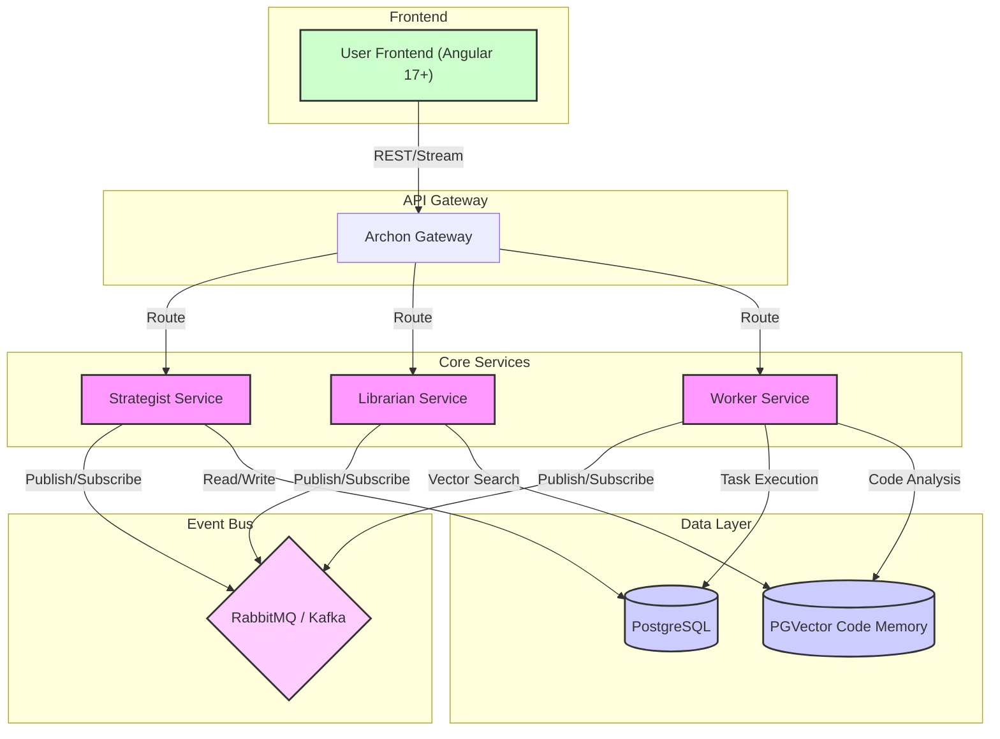

# Archon: Autonomous IT Project Engine

[](https://opensource.org/licenses/Apache-2.0)
[]()
[](CONTRIBUTING.md)

**Archon** is an AI-driven orchestration platform designed to automate IT migrations and project management. By analyzing a GitHub repository, Archon generates a full Scrum backlog and deploys specialized AI agents to execute tasks, write code, and provide daily standup feedback.

---

## 🚀 Features

- **Automated Backlog Generation**: Analyzes codebases to create Scrum-ready user stories and tasks.
- **AI Agent Deployment**: Orchestrates specialized agents for coding, testing, and project management.
- **Real-time Feedback**: Provides daily standup reports and progress tracking.
- **Seamless Integration**: Connects with GitHub, JIRA, and other development tools.

## 🛠 Tech Stack

### Backend
- **Language**: Java 21
- **Framework**: Spring Boot 3.x
- **AI Integration**: Spring AI
- **Microservices**: Spring Cloud

### Frontend
- **Framework**: Angular 17+
- **Reactive Programming**: RxJS for real-time streaming

### Data & Messaging
- **Database**: MySQL
- **Vector Search**: PGVector (for codebase "memory")
- **Messaging**: RabbitMQ / Kafka for inter-agent communication

## 🏗 Architecture

The following diagram illustrates the high-level architecture of Archon, showcasing the flow from user interaction to agent execution.



## 🏁 Getting Started

### Prerequisites
- JDK 21
- Node.js 18+ & npm
- Docker & Docker Compose (for DB and MQ)

### Installation

1.  **Clone the repository**
    ```bash
    git clone https://github.com/tanmaysinghx/archon.git
    cd archon
    ```

2.  **Start Infrastructure**
    ```bash
    docker-compose up -d postgres rabbitmq
    ```

3.  **Build and Run Backend Services**
    Navigate to each service directory (e.g., `archon-gateway`, `archon-strategist`) and run:
    ```bash
    ./mvnw spring-boot:run
    ```

4.  **Run Frontend**
    ```bash
    cd archon-frontend
    npm install
    npm start
    ```

5.  Access the application at `http://localhost:4200`.

## 🤝 Contributing

We welcome contributions! Please see [CONTRIBUTING.md](CONTRIBUTING.md) for details on how to get started, our code of conduct, and submission guidelines.

## 📄 License

This project is licensed under the Apache 2.0 License - see the [LICENSE](LICENSE) file for details.
